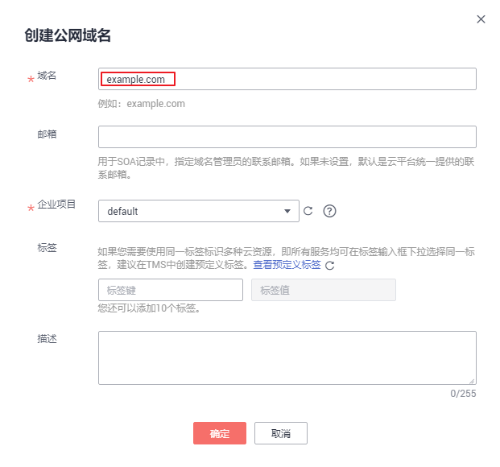

# 创建公网域名

## 操作场景

如果想要使用华为云的云解析服务对您注册的域名进行解析，您需要先将域名添加至云解析服务中。

## 前提条件

已经通过华为云的[域名注册服务](https://support.huaweicloud.com/domain/index.html)或者第三方域名注册商完成域名的注册。

## 华为云注册的域名

通过华为云的[域名注册服务](https://support.huaweicloud.com/domain/index.html)注册的域名无需添加，您可以直接在云解析服务的“域名列表”中查看注册的域名。

1.  登录管理控制台。
2.  选择“网络 \> 云解析服务”。

    进入“云解析”页面。

3.  在左侧树状导航栏，选择“域名解析 \> 公网解析”。

    在“公网域名”页面，您可以查看到注册的域名已经被添加到域名列表中。

4.  在域名所在行，单击域名的名称或者“操作”列的“解析”，进入“解析记录”页面。

    在“解析记录”页面，可以通过“添加记录集”为域名配置解析记录，详细内容请参见[记录集管理简介](记录集管理简介.md)。

    **图 1**  域名解析记录  
    

## 非华为云注册的域名

通过第三方域名注册商注册的域名，需要通过“创建公网域名”的操作将域名添加至云解析服务。

1.  登录管理控制台。
2.  选择“网络 \> 云解析服务”。

    进入“云解析”页面。

3.  在左侧树状导航栏，选择“域名解析 \> 公网解析”。

    进入“公网域名”页面。

4.  在页面右上角，单击“创建公网域名”。
5.  在“创建公网域名”页面中，输入域名及相关参数。

    **图 2**  创建公网域名  
    

    参数说明如[表1](#zh-cn_topic_0138290753_zh-cn_topic_0035467699_table2052132816642)所示。

    **表 1**  创建公网域名参数说明

    
    <table><thead align="left"><tr id="zh-cn_topic_0138290753_zh-cn_topic_0035467699_row5957484916642"><th class="cellrowborder" valign="top" width="18.11%" id="mcps1.2.4.1.1">
参数

    </th>
    <th class="cellrowborder" valign="top" width="50.629999999999995%" id="mcps1.2.4.1.2">
参数说明

    </th>
    <th class="cellrowborder" valign="top" width="31.259999999999998%" id="mcps1.2.4.1.3">
取值样例

    </th>
    </tr>
    </thead>
    <tbody><tr id="zh-cn_topic_0138290753_zh-cn_topic_0035467699_row2871871016642"><td class="cellrowborder" valign="top" width="18.11%" headers="mcps1.2.4.1.1 ">
域名

    </td>
    <td class="cellrowborder" valign="top" width="50.629999999999995%" headers="mcps1.2.4.1.2 ">
从域名注册商处获得的授权域名。

    </td>
    <td class="cellrowborder" valign="top" width="31.259999999999998%" headers="mcps1.2.4.1.3 ">
example.com

    </td>
    </tr>
    <tr id="zh-cn_topic_0138290753_zh-cn_topic_0035467699_row3925088716642"><td class="cellrowborder" valign="top" width="18.11%" headers="mcps1.2.4.1.1 ">
邮箱

    </td>
    <td class="cellrowborder" valign="top" width="50.629999999999995%" headers="mcps1.2.4.1.2 ">
可选参数。

    
管理该公网域名的管理员邮箱。建议用户使用保留邮箱“HOSTMASTER@<em id="zh-cn_topic_0138290753_i31584450204027">域名</em>”作为此管理员邮箱。

    
更多关于邮箱的信息，请参见<a href="https://support.huaweicloud.com/dns_faq/dns_faq_009.html" target="_blank" rel="noopener noreferrer">SOA记录中的Email格式为什么变化了？</a>。

    </td>
    <td class="cellrowborder" valign="top" width="31.259999999999998%" headers="mcps1.2.4.1.3 ">
HOSTMASTER@example.com

    </td>
    </tr>
    <tr id="zh-cn_topic_0138290753_row105410594141"><td class="cellrowborder" valign="top" width="18.11%" headers="mcps1.2.4.1.1 ">
标签

    </td>
    <td class="cellrowborder" valign="top" width="50.629999999999995%" headers="mcps1.2.4.1.2 ">
可选参数。

    
域名的标识，包括键和值，每个域名可以创建10个标签。

    
键和值的命名规则请参见<a href="#zh-cn_topic_0138290753_table18290035121711">表2</a>。

    </td>
    <td class="cellrowborder" valign="top" width="31.259999999999998%" headers="mcps1.2.4.1.3 ">
example_key1

    
example_value1

    </td>
    </tr>
    <tr id="zh-cn_topic_0138290753_row197267115553"><td class="cellrowborder" valign="top" width="18.11%" headers="mcps1.2.4.1.1 ">
描述

    </td>
    <td class="cellrowborder" valign="top" width="50.629999999999995%" headers="mcps1.2.4.1.2 ">
可选参数。

    
域名的描述信息。

    
长度不超过255个字符。

    </td>
    <td class="cellrowborder" valign="top" width="31.259999999999998%" headers="mcps1.2.4.1.3 ">
This is a zone example.

    </td>
    </tr>
    </tbody>
    </table>

    **表 2**  标签命名规则

    
    <table><thead align="left"><tr id="zh-cn_topic_0138290753_row72901535141713"><th class="cellrowborder" valign="top" width="18.181818181818183%" id="mcps1.2.4.1.1">
参数

    </th>
    <th class="cellrowborder" valign="top" width="50.505050505050505%" id="mcps1.2.4.1.2">
规则

    </th>
    <th class="cellrowborder" valign="top" width="31.313131313131315%" id="mcps1.2.4.1.3">
举例

    </th>
    </tr>
    </thead>
    <tbody><tr id="zh-cn_topic_0138290753_row52906354176"><td class="cellrowborder" valign="top" width="18.181818181818183%" headers="mcps1.2.4.1.1 ">
键

    </td>
    <td class="cellrowborder" valign="top" width="50.505050505050505%" headers="mcps1.2.4.1.2 "><ul id="zh-cn_topic_0138290753_ul46253231183"><li>不能为空。</li><li>对于同一资源键值唯一。</li><li>长度不超过36个字符。</li><li>取值为不包含“=”、“*”、“&lt;”、“&gt;”、“\”、“,”、“|”、“/”的所有Unicode字符，且首尾字符不能为空格。</li></ul>
    </td>
    <td class="cellrowborder" valign="top" width="31.313131313131315%" headers="mcps1.2.4.1.3 ">
example_key1

    </td>
    </tr>
    <tr id="zh-cn_topic_0138290753_row132900355172"><td class="cellrowborder" valign="top" width="18.181818181818183%" headers="mcps1.2.4.1.1 ">
值

    </td>
    <td class="cellrowborder" valign="top" width="50.505050505050505%" headers="mcps1.2.4.1.2 "><ul id="zh-cn_topic_0138290753_ul19648123161815"><li>不能为空。</li><li>长度不超过43个字符。</li><li>取值为不包含“=”、“*”、“&lt;”、“&gt;”、“\”、“,”、“|”、“/”的所有Unicode字符，且首尾字符不能为空格。</li></ul>
    </td>
    <td class="cellrowborder" valign="top" width="31.313131313131315%" headers="mcps1.2.4.1.3 ">
example_value1

    </td>
    </tr>
    </tbody>
    </table>

6.  单击“确定”。

    创建完成后，您可以在“公网域名”页面的域名列表中查看新创建的域名信息。

    若提示“域名已经被其他租户创建。”，请参考[找回域名](找回域名.md)。

7.  在“公网域名”页面的域名列表中，单击域名的名称或者“操作”列的“解析”，进入“解析记录”页面。

    在“解析记录”页面，可以通过“添加记录集”为域名配置解析记录，详细内容请参见[记录集管理简介](记录集管理简介.md)。

    **图 3**  域名解析记录  
    

    > **说明：**   
    >单击“名称”列的域名名称，可以看到系统已经为您创建了SOA类型和NS类型的记录集。其中，  
    >-   SOA类型的记录集标识了对此域名具有最终解释权的主权威服务器。  
    >-   NS类型的记录集标识了此域名的权威服务器。  

## 后续操作

创建公网域名完成后，

-   可以为域名配置解析记录，请参见[记录集管理简介](记录集管理简介.md)。
-   可以对域名进行修改、删除、查看详细信息等操作，请参见[管理公网域名](管理公网域名.md)。

