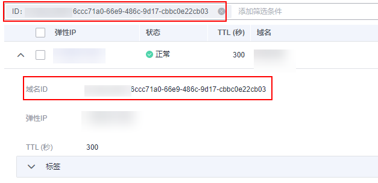
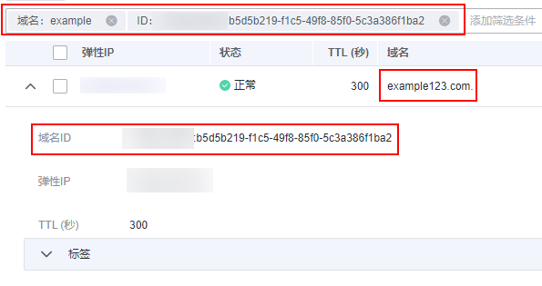
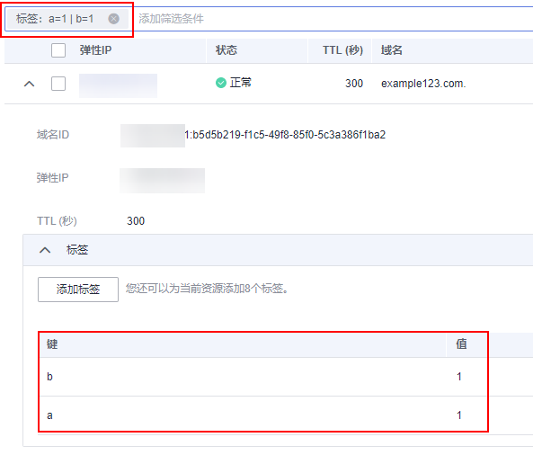

# 搜索反向解析

## 操作场景

DNS管理控制台提供的搜索功能快速检索反向解析。单击搜索框可以选择搜索属性。

-   搜索类型：精确搜索、模糊搜索。
-   搜索属性：弹性公网IP、域名、ID、状态、标签、企业项目。

本节操作介绍搜索反向解析的方法。

## 搜索语法

反向解析支持多种类型的搜索，首先了解搜索类型、搜索属性、搜索语法。详细的搜索语法和示例请参考[表1](#table145381755194911)。

-   搜索类型：精确搜索、模糊搜索。
-   搜索属性：弹性公网IP、域名、ID、状态、标签、企业项目。
    -   支持精确搜索的属性：弹性公网IP、域名、ID、状态、标签、企业项目。精确搜索时必须输入完整的属性值。
    -   支持模糊搜索的属性：弹性公网IP、域名。

> **说明：** 
>按标签过滤时可选择键或键值对搜索，支持设置多个标签：
>-   如果键不同，标签按“与”的关系搜索。
>-   如果键相同，值不同，标签按“与”的关系搜索。

**表 1**  反向解析搜索语法

<table><thead align="left"><tr id="row1153820554493"><th class="cellrowborder" valign="top" width="14.5985401459854%" id="mcps1.2.6.1.1">
搜索类型

</th>
<th class="cellrowborder" valign="top" width="19.28807119288071%" id="mcps1.2.6.1.2">
支持的属性

</th>
<th class="cellrowborder" valign="top" width="17.16828317168283%" id="mcps1.2.6.1.3">
输入格式

</th>
<th class="cellrowborder" valign="top" width="23.897610238976103%" id="mcps1.2.6.1.4">
示例

</th>
<th class="cellrowborder" valign="top" width="25.047495250474956%" id="mcps1.2.6.1.5">
说明

</th>
</tr>
</thead>
<tbody><tr id="row6538105534919"><td class="cellrowborder" valign="top" width="14.5985401459854%" headers="mcps1.2.6.1.1 ">
仅输入属性值，但不选择属性

</td>
<td class="cellrowborder" valign="top" width="19.28807119288071%" headers="mcps1.2.6.1.2 ">
默认按照域名模糊搜索。

</td>
<td class="cellrowborder" valign="top" width="17.16828317168283%" headers="mcps1.2.6.1.3 ">
属性值

</td>
<td class="cellrowborder" valign="top" width="23.897610238976103%" headers="mcps1.2.6.1.4 ">
example.com

</td>
<td class="cellrowborder" valign="top" width="25.047495250474956%" headers="mcps1.2.6.1.5 ">
未选择搜索属性，仅输入属性值时默认是按照域名模糊搜索。

</td>
</tr>
<tr id="row8538455154915"><td class="cellrowborder" valign="top" width="14.5985401459854%" headers="mcps1.2.6.1.1 ">
单属性

</td>
<td class="cellrowborder" valign="top" width="19.28807119288071%" headers="mcps1.2.6.1.2 ">
控制台支持的所有属性

</td>
<td class="cellrowborder" valign="top" width="17.16828317168283%" headers="mcps1.2.6.1.3 ">
属性：属性值

</td>
<td class="cellrowborder" valign="top" width="23.897610238976103%" headers="mcps1.2.6.1.4 ">
状态：正常

</td>
<td class="cellrowborder" valign="top" width="25.047495250474956%" headers="mcps1.2.6.1.5 ">
选择属性后，输入对应的属性信息，系统进行精确搜索。

弹性公网IP、域名支持模糊搜索。

</td>
</tr>
<tr id="row1053975524910"><td class="cellrowborder" valign="top" width="14.5985401459854%" headers="mcps1.2.6.1.1 ">
多属性

</td>
<td class="cellrowborder" valign="top" width="19.28807119288071%" headers="mcps1.2.6.1.2 ">
控制台支持的所有属性

</td>
<td class="cellrowborder" valign="top" width="17.16828317168283%" headers="mcps1.2.6.1.3 ">
属性：取值 &amp;属性：取值

</td>
<td class="cellrowborder" valign="top" width="23.897610238976103%" headers="mcps1.2.6.1.4 ">
状态：正常 名称：example.com

</td>
<td class="cellrowborder" valign="top" width="25.047495250474956%" headers="mcps1.2.6.1.5 ">
支持选择多个不同的属性，搜索时多个属性为“与”的关系。

弹性公网IP、域名支持模糊搜索。

</td>
</tr>
</tbody>
</table>

## 操作步骤

1.  登录管理控制台。
2.  将鼠标悬浮于页面左侧的“”，在服务列表中，选择“网络  \> 云解析服务”。

    进入“云解析”页面。

3.  在左侧树状导航栏，选择“反向解析”。

    进入“反向解析”页面。

4.  单击管理控制台左上角的，选择区域和项目。
5.  在反向解析的搜索输入框中，根据提示选择搜索属性，例如域名、ID、状态、标签等，并输入属性值单击进行搜索。

## 示例1：使用属性值搜索，系统自动匹配属性

输入属性值后，系统默认按照域名名称模糊搜索。

在反向解析列表页面，搜索的输入框中输入域名名称，单击进行搜索。

例如，如[图1](#fig185501838161012)所示，输入域名名称，回车后默认按照域名名称模糊搜索，搜索结果如[图2](#fig11797111133)所示，模糊匹配所有包含该名称的域名。

**图 1**  输入反向解析域名名称  

**图 2**  模糊匹配域名名称后的搜索结果  

## 示例2：单属性搜索

选择属性后，输入对应的属性信息。

以下属性仅支持精确搜索，需输入完整的属性值：ID、状态、标签、企业项目。

-   模糊搜索：仅域名名称支持模糊搜索
    1.  在反向解析列表页搜索的输入框中选择“域名”。
    2.  根据提示，输入域名名称，单击进行搜索。域名支持模糊搜索，例如输入“example”，可以搜索到所有使用example的反向解析。

        **图 3**  模糊匹配域名名称进行搜索  
        

-   精确搜索：ID
    1.  在反向解析列表页搜索的输入框中选择“ID”。
    2.  根据提示，输入完整域名ID，单击进行搜索。

        **图 4**  使用域名ID搜素反向解析  
        

## 示例3：多属性搜索

支持选择多个不同的属性，搜索时多个属性为“与”的关系。

以下属性仅支持精确搜索，需输入完整的属性值：ID、状态、标签、企业项目。

本例同时使用“域名”和“域名ID”进行搜索。

1.  在反向解析列表页搜索的输入框中选择“域名”并输入取值。单击进行搜索。本例域名名称使用模糊搜索。
2.  添加筛选条件，选择“ID”，根据提示输入域名ID，单击进行搜索。

    **图 5**  多属性搜索反向解析  
    

## 示例4：按标签搜索

按标签过滤时可选择键或键值对搜索。

支持设置多个标签，如果键不同，则标签按“与”的关系搜索。

如果键相同，值不同，则标签按“与”的关系搜索。

-   单个标签搜索

    在反向解析列表页搜索的输入框中选择“标签”，选择标签键值对，单击“确认”进行搜索。

    **图 6**  按标签搜索反向解析  
    

-   多个标签搜索

    在反向解析列表页搜索的输入框中选择“标签”，选择多个标签键值对，单击“确认”进行搜索。

    按“与”的关系搜索，搜索同时具备这两个标签的域名。

    **图 7**  多个标签搜索反向解析  
    

