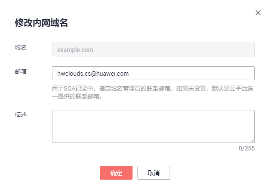
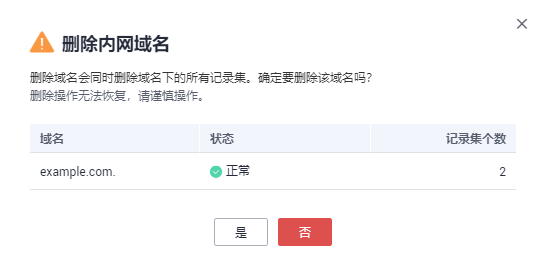

# 管理内网域名

## 操作场景

您可以修改或者删除已经创建到云解析服务的内网域名，同时还可以查看内网域名的详细信息。

## 修改内网域名

在使用内网域名的过程中，如果发现内网域名的配置信息不符合您的业务需求，可以重新设置域名的管理员邮箱地址、域名的描述信息。

> **说明：**   
>更多关于域名管理员邮箱的信息，请参见[SOA记录中的Email格式为什么变化了？](https://support.huaweicloud.com/dns_faq/dns_faq_009.html)。  

1.  登录管理控制台。
2.  选择“网络 \> 云解析服务”。

    进入“云解析”页面。

3.  在左侧树状导航栏，选择“域名解析 \> 内网解析”。

    进入“内网域名”页面。

4.  单击管理控制台左上角的，选择区域和项目。

1.  选择待修改的内网域名，单击“操作”列下的“修改”。

    进入“修改内网域名”页面。

    **图 1**  修改内网域名  
    

2.  根据实际需要，修改“邮箱”或“描述”信息。
3.  单击“确定”，保存修改后的内网域名。

## 删除内网域名

当用户无需使用云解析服务托管该内网域名时，可以使用删除内网域名功能。删除内网域名后，该内网域名包含的域名将无法再被解析。

> **须知：**   
>执行删除内网域名操作前，请确认已备份该内网域名下所有用户创建的记录集。  

1.  登录管理控制台。
2.  选择“网络 \> 云解析服务”。

    进入“云解析”页面。

3.  在左侧树状导航栏，选择“域名解析 \> 内网解析”。

    进入“内网域名”页面。

4.  单击管理控制台左上角的，选择区域和项目。

1.  选择待删除的内网域名，单击“操作”列下的“删除”。

    进入“删除内网域名”页面。

    **图 2**  删除内网域名  
    

2.  单击“确定”，确认删除该内网域名。

## 批量删除内网域名

当用户想要一次性删除多个内网域名时，可以使用批量删除功能。删除内网域名后，域名将无法再被解析。

> **须知：**   
>执行删除内网域名操作前，请确认已备份内网域名下所有用户创建的记录集。  

1.  登录管理控制台。
2.  选择“网络 \> 云解析服务”。

    进入“云解析”页面。

3.  在左侧树状导航栏，选择“域名解析 \> 内网解析”。

    进入“内网域名”页面。

1.  单击管理控制台左上角的，选择区域和项目。
2.  勾选待删除的内网域名，单击“删除”。

    **图 3**  批量删除内网域名  
    

3.  在“删除内网域名”页面，单击“是”，确认删除内网域名。

    **图 4**  确认删除内网域名  
    

## 查看内网域名详情

您可以在内网域名列表页面查询域名的详细信息，包括域名ID、域名创建或最近一次修改时间、TTL、标签等。

1.  登录管理控制台。
2.  选择“网络 \> 云解析服务”。

    进入“云解析”页面。

1.  在“总览”页签，选择“我的资源”下的“内网解析”。
2.  单击管理控制台左上角的，选择区域和项目。
3.  在内网域名列表页面，单击域名前面的“”查看内网域名详情。

    **图 5**  内网域名详情  
    

