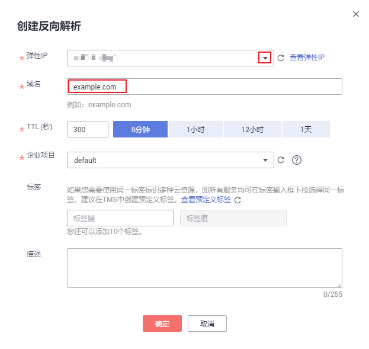

# 管理反向解析

## 查看反向解析详情

反向解析创建完成后，您可以在“反向解析”页面查看新创建的反向解析信息。

1.  登录管理控制台。
2.  选择“网络 \> 云解析服务”。

    进入云解析服务页面。

3.  在“总览”页签，选择“我的资源”下的“反向解析”，查看反向解析列表。
4.  在反向解析列表页面，查看反向解析详情。

## 增加反向解析

如果您通过其他云服务（如ECS）获得了新的弹性IP，且希望设置该弹性IP的反向解析域名，可以使用增加反向解析功能。

1.  登录管理控制台。
2.  选择“网络 \> 云解析服务”。

    进入云解析服务页面。

3.  在左侧树状导航栏，选择“域名解析 \> 反向解析”。

    进入“反向解析”页面。

4.  单击“创建反向解析”，开始创建反向解析。

    **图 1**  创建反向解析  
    

5.  根据界面提示配置参数，参数说明如[表1](#zh-cn_topic_0040322596_zh-cn_topic_0035467699_table2052132816642)所示。

    **表 1**  创建反向解析参数说明

    
    <table><thead align="left"><tr id="zh-cn_topic_0040322596_zh-cn_topic_0035467699_row5957484916642"><th class="cellrowborder" valign="top" width="19.99%" id="mcps1.2.4.1.1">
参数

    </th>
    <th class="cellrowborder" valign="top" width="48.75%" id="mcps1.2.4.1.2">
参数说明

    </th>
    <th class="cellrowborder" valign="top" width="31.259999999999998%" id="mcps1.2.4.1.3">
取值样例

    </th>
    </tr>
    </thead>
    <tbody><tr id="zh-cn_topic_0040322596_zh-cn_topic_0035467699_row2871871016642"><td class="cellrowborder" valign="top" width="19.99%" headers="mcps1.2.4.1.1 ">
弹性IP

    </td>
    <td class="cellrowborder" valign="top" width="48.75%" headers="mcps1.2.4.1.2 ">
您通过其他云服务（如ECS）获得的弹性IP。

    
该参数支持通过输入框快速定位到所需要的弹性IP。

    </td>
    <td class="cellrowborder" valign="top" width="31.259999999999998%" headers="mcps1.2.4.1.3 ">
XX.XX.XX.XX

    </td>
    </tr>
    <tr id="zh-cn_topic_0040322596_zh-cn_topic_0035467699_row6656618516642"><td class="cellrowborder" valign="top" width="19.99%" headers="mcps1.2.4.1.1 ">
域名

    </td>
    <td class="cellrowborder" valign="top" width="48.75%" headers="mcps1.2.4.1.2 ">
弹性IP所指向的域名。

    </td>
    <td class="cellrowborder" valign="top" width="31.259999999999998%" headers="mcps1.2.4.1.3 ">
www.example.com

    </td>
    </tr>
    <tr id="zh-cn_topic_0040322596_zh-cn_topic_0035467699_row2168553016642"><td class="cellrowborder" valign="top" width="19.99%" headers="mcps1.2.4.1.1 ">
TTL(秒)

    </td>
    <td class="cellrowborder" valign="top" width="48.75%" headers="mcps1.2.4.1.2 ">
反向解析的有效缓存时间，以秒为单位。

    
默认为“5min”，即300s。

    </td>
    <td class="cellrowborder" valign="top" width="31.259999999999998%" headers="mcps1.2.4.1.3 ">
300

    </td>
    </tr>
    <tr id="zh-cn_topic_0040322596_row273617193297"><td class="cellrowborder" valign="top" width="19.99%" headers="mcps1.2.4.1.1 ">
标签

    </td>
    <td class="cellrowborder" valign="top" width="48.75%" headers="mcps1.2.4.1.2 ">
可选参数。

    
反向解析的标示，包括键和值，每个反向解析可以创建10个标签。

    
键和值的命名规则请参见<a href="#zh-cn_topic_0077500015__zh-cn_topic_0040322596_table1393932617253">表2</a>。

    </td>
    <td class="cellrowborder" valign="top" width="31.259999999999998%" headers="mcps1.2.4.1.3 ">
example_key1

    
example_value1

    </td>
    </tr>
    <tr id="zh-cn_topic_0040322596_zh-cn_topic_0035467699_row3925088716642"><td class="cellrowborder" valign="top" width="19.99%" headers="mcps1.2.4.1.1 ">
描述

    </td>
    <td class="cellrowborder" valign="top" width="48.75%" headers="mcps1.2.4.1.2 ">
可选配置，对反向解析的描述。

    </td>
    <td class="cellrowborder" valign="top" width="31.259999999999998%" headers="mcps1.2.4.1.3 ">
The description of the PTR Record.

    </td>
    </tr>
    </tbody>
    </table>

    **表 2**  标签命名规则

    
    <table><thead align="left"><tr id="zh-cn_topic_0040322596_zh-cn_topic_0035467699_row72901535141713"><th class="cellrowborder" valign="top" width="18.181818181818183%" id="mcps1.2.4.1.1">
参数

    </th>
    <th class="cellrowborder" valign="top" width="50.505050505050505%" id="mcps1.2.4.1.2">
规则

    </th>
    <th class="cellrowborder" valign="top" width="31.313131313131315%" id="mcps1.2.4.1.3">
举例

    </th>
    </tr>
    </thead>
    <tbody><tr id="zh-cn_topic_0040322596_zh-cn_topic_0035467699_row52906354176"><td class="cellrowborder" valign="top" width="18.181818181818183%" headers="mcps1.2.4.1.1 ">
键

    </td>
    <td class="cellrowborder" valign="top" width="50.505050505050505%" headers="mcps1.2.4.1.2 "><ul id="zh-cn_topic_0040322596_zh-cn_topic_0035467699_ul46253231183"><li>不能为空。</li><li>对于同一资源键值唯一。</li><li>长度不超过36个字符。</li><li>取值为不包含“=”,“*”,“&lt;”,“&gt;”,“\”,“,”,“|”,“/”的所有Unicode字符，且首尾字符不能为空格。</li></ul>
    </td>
    <td class="cellrowborder" valign="top" width="31.313131313131315%" headers="mcps1.2.4.1.3 ">
example_key1

    </td>
    </tr>
    <tr id="zh-cn_topic_0040322596_zh-cn_topic_0035467699_row132900355172"><td class="cellrowborder" valign="top" width="18.181818181818183%" headers="mcps1.2.4.1.1 ">
值

    </td>
    <td class="cellrowborder" valign="top" width="50.505050505050505%" headers="mcps1.2.4.1.2 "><ul id="zh-cn_topic_0040322596_zh-cn_topic_0035467699_ul19648123161815"><li>不能为空。</li><li>长度不超过43个字符。</li><li>取值为不包含“=”,“*”,“&lt;”,“&gt;”,“\”,“,”,“|”,“/”的所有Unicode字符，且首尾字符不能为空格。</li></ul>
    </td>
    <td class="cellrowborder" valign="top" width="31.313131313131315%" headers="mcps1.2.4.1.3 ">
example_value1

    </td>
    </tr>
    </tbody>
    </table>

6.  单击“确定”。

    创建完成后，您可以在“反向解析”页面查看新创建的反向解析信息。

    > **说明：**   
    >如果您的域名（如example.com）拥有多个弹性IP，则需要为每一个弹性IP创建一个反向解析。  

## 修改反向解析

如果弹性IP对应的反向解析域名变更，或者需要修改TTL、描述，可以使用修改反向解析功能。

1.  登录管理控制台。
2.  选择“网络 \> 云解析服务”。

    进入云解析服务页面。

3.  在左侧树状导航栏，选择“域名解析 \> 反向解析”。

    进入“反向解析”页面。

4.  选择待修改的反向解析，单击“操作”列下的“修改”。

    系统进入“修改反向解析”页面。

5.  根据实际需要，修改弹性IP对应的域名、TTL或描述。
6.  单击“确定”，保存修改后的反向解析。

## 删除反向解析

当用户无需使用该反向解析时，可以使用删除反向解析功能。删除反向解析后，该弹性IP的反向解析域名将会变更为华为云平台提供的默认域名。

1.  登录管理控制台。
2.  选择“网络 \> 云解析服务”。

    进入云解析服务页面。

3.  在左侧树状导航栏，选择“域名解析 \> 反向解析”。

    进入“反向解析”页面。

4.  选择待删除的反向解析，单击“操作”列下的“删除”。
5.  单击“确定”，完成删除操作。

