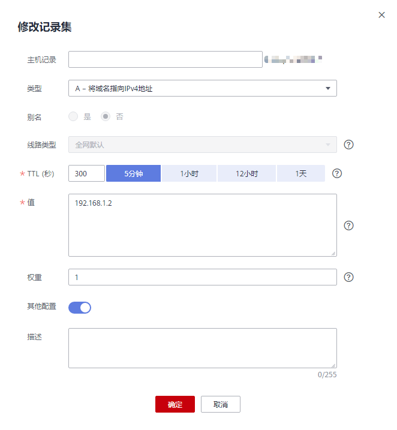
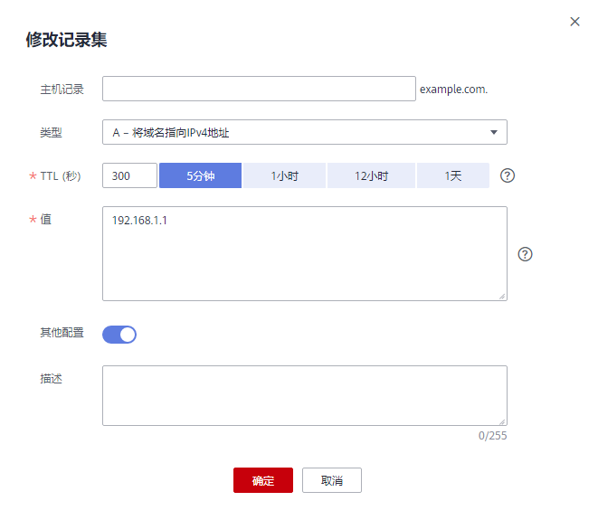
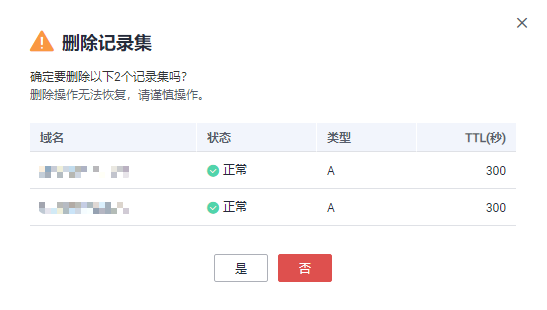

# 管理记录集

## 操作场景

您可以修改、删除、暂停或者启用已经添加的记录集，同时还可以查看记录集的详细信息。

## 修改记录集

在使用记录集的过程中，如果发现记录集的配置信息不符合您的业务需求，可以通过修改记录集功能，重新设置记录集的主机记录、类型、TTL、值、权重以及描述等参数。

> **说明：** 
>-   仅支持修改系统自动生成的NS记录集的TTL、值、描述等参数。
>-   不支持修改系统自动生成的SOA类型的记录集。

1.  登录管理控制台。
2.  将鼠标悬浮于页面左侧的“”，在服务列表中，选择“网络 \> 云解析服务”。

    进入“云解析”页面。

3.  在左侧树状导航栏，选择“域名解析 \> 公网解析”或者“域名解析 \> 内网解析”。

    进入域名列表页面。

4.  （可选）如果选择“内网解析”，请单击管理控制台左上角的，选择区域和项目。
5.  在域名列表页面，单击域名名称。

    进入“解析记录”页面。

6.  选择待修改的记录集，单击“操作”列下的“修改”。

    进入“修改记录集”页面。

7.  根据实际需要，修改记录集的配置参数。

    -   对于公网解析，支持修改记录集的主机记录、类型、TTL、值、权重以及描述。
    -   对于内网解析，支持修改记录集的主机记录、类型、TTL、值以及描述。

    相关参数详细说明，请参见[添加记录集](添加记录集.md)。

    **图 1**  修改记录集（公网解析）  
    

    **图 2**  修改记录集（内网解析）  
    

8.  单击“确定”，保存修改后的记录集。

## 暂停/启用记录集

该功能仅支持公网域名的记录集使用。

用户可以将某个解析记录暂停，暂停后，该解析记录不再参与解析，但用户可以在解析列表中看到该解析记录。

该操作可以用于网站备案时，暂停域名的解析

> **说明：** 
>不支持暂停/启用系统自动生成的NS类型和SOA类型的记录集。

1.  登录管理控制台。
2.  将鼠标悬浮于页面左侧的“”，在服务列表中，选择“网络 \> 云解析服务”。

    进入“云解析”页面。

1.  在左侧树状导航栏，选择“域名解析 \> 公网解析”。

    进入“公网域名”页面。

2.  在域名列表页面，单击域名名称。

    进入“解析记录”页面。

3.  选择待暂停/启用的记录集，单击“操作”列下的“暂停”/“启用”。

    进入“暂停记录集”/“启用记录集”页面。

4.  单击“确定”，暂停/启用当前解析记录。

## 删除记录集

> **说明：** 
>不支持删除系统自动生成的NS类型和SOA类型的记录集。

当用户无需使用该记录集时，可以使用删除记录集功能。删除记录集后，对应类型的记录集功能会失效。例如，如果删除A类型记录集，该域名将无法被解析为一个IPv4地址。如果删除CNAME类型记录集，该别名将无法映射到之前指定的域名上。

1.  登录管理控制台。
2.  将鼠标悬浮于页面左侧的“”，在服务列表中，选择“网络 \> 云解析服务”。

    进入“云解析”页面。

1.  在“总览”页签，选择“我的资源”下的“公网解析”或者“内网解析”。

    进入域名列表页。

2.  （可选）如果选择“内网解析”，请单击管理控制台左上角的，选择区域和项目。
3.  在域名列表页面，单击域名名称。

    进入“解析记录”页面。

4.  选择待删除的记录集，单击“操作”列下的“删除”。
5.  单击“确定”，确认删除该记录集。

## 批量删除记录集（单个域名）

当用户想要一次性删除某个域名的多个记录集时，可以使用批量删除功能。删除记录集后，记录集对应的解析会失效，且无法恢复。

> **说明：** 
>-   如果想要批量删除多个域名的记录集，请参考[批量删除记录集](批量删除记录集.md)操作。
>-   不支持批量删除系统自动生成的NS类型和SOA类型的记录集。

1.  登录管理控制台。
2.  将鼠标悬浮于页面左侧的“”，在服务列表中，选择“网络 \> 云解析服务”。

    进入“云解析”页面。

3.  在左侧树状导航栏，选择“域名解析 \> 公网解析”或者“域名解析 \> 内网解析”。

    进入域名列表页面。

4.  （可选）如果选择“内网解析”，请单击管理控制台左上角的，选择区域和项目。

1.  勾选待删除的记录集，单击“删除”。

    **图 3**  批量删除记录集  
    

2.  在“删除记录集”页面，单击“是”，确认删除记录集。

    **图 4**  确认删除记录集  
    

## 查看记录集详情

1.  登录管理控制台。
2.  将鼠标悬浮于页面左侧的“”，在服务列表中，选择“网络 \> 云解析服务”。

    进入“云解析”页面。

1.  在左侧树状导航栏，选择“域名解析 \> 公网解析”或者“域名解析 \> 内网解析”。

    进入域名列表页面。

2.  （可选）如果选择“内网解析”，请单击管理控制台左上角的，选择区域和项目。
3.  在域名列表页面，单击域名名称。

    进入“解析记录”页面。

4.  在解析记录页面，单击“”查看记录集详情。

