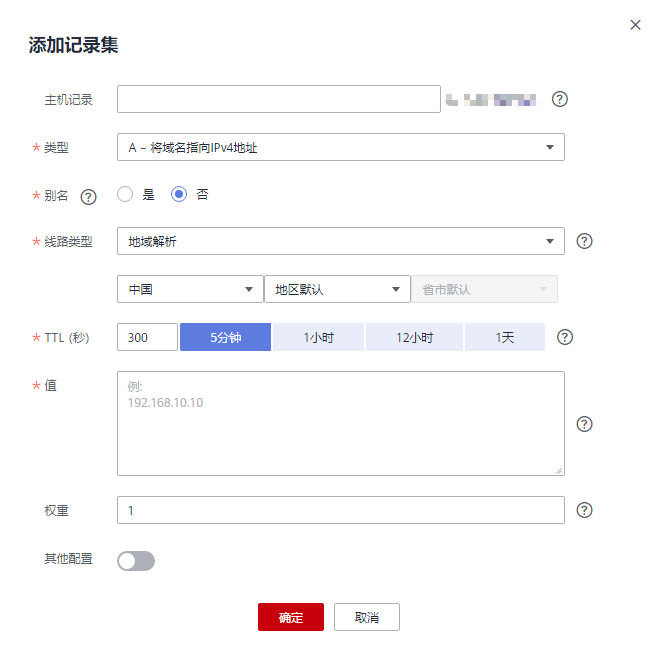

# 配置自定义线路解析

## 操作场景

自定义线路解析，支持DNS根据访问者的IP地址返回特定的IP地址。

> **说明：** 
>-   如果访问者所属Local DNS不支持扩展DNS机制（Extension Mechanisms for DNS，EDNS），则DNS根据访问者所属Local DNS的IP地址进行自定义线路解析。
>-   如果访问者所属Local DNS支持EDNS机制，则DNS根据访问者的IP地址进行自定义线路解析。

在普通的域名解析中，DNS根据访问请求中的域名直接返回对应的IP地址，不考虑访问者的网络、地域或者IP地址等来源信息，所有的访问请求都被路由到同样的IP地址。

如果有一个网站，对外的域名为example.com，想要实现外部用户访问网站服务器A（对应IP地址为1.1.1.1），内部用户访问网站服务器B（2.2.2.2），可以通过自定义线路功能实现。

## 步骤一：创建自定义线路

1.  登录管理控制台。
2.  将鼠标悬浮于页面左侧的“”，在服务列表中，选择“网络  \> 云解析服务”。

    进入“云解析”页面。

3.  在左侧树状导航栏，选择“域名解析 \> 自定义线路”。

    进入“自定义线路”页面。

4.  单击“添加线路”，开始创建自定义线路。

    **图 1**  添加自定义线路  
    

5.  根据界面提示配置参数，参数说明如[表1](#table3963814184716)所示。

    **表 1**  添加自定义线路参数说明

    
    <table><thead align="left"><tr id="row696418142478"><th class="cellrowborder" valign="top" width="24.097590240975897%" id="mcps1.2.5.1.1">
参数

    </th>
    <th class="cellrowborder" valign="top" width="33.086691330866906%" id="mcps1.2.5.1.2">
参数说明

    </th>
    <th class="cellrowborder" valign="top" width="22.24777522247775%" id="mcps1.2.5.1.3">
取值样例1

    </th>
    <th class="cellrowborder" valign="top" width="20.567943205679427%" id="mcps1.2.5.1.4">
取值样例2

    </th>
    </tr>
    </thead>
    <tbody><tr id="row20964131474710"><td class="cellrowborder" valign="top" width="24.097590240975897%" headers="mcps1.2.5.1.1 ">
线路名称

    </td>
    <td class="cellrowborder" valign="top" width="33.086691330866906%" headers="mcps1.2.5.1.2 ">
自定义线路名称。

    </td>
    <td class="cellrowborder" valign="top" width="22.24777522247775%" headers="mcps1.2.5.1.3 ">
Line1

    </td>
    <td class="cellrowborder" valign="top" width="20.567943205679427%" headers="mcps1.2.5.1.4 ">
Line2

    </td>
    </tr>
    <tr id="row196411146473"><td class="cellrowborder" valign="top" width="24.097590240975897%" headers="mcps1.2.5.1.1 ">
IP地址范围

    </td>
    <td class="cellrowborder" valign="top" width="33.086691330866906%" headers="mcps1.2.5.1.2 ">
DNS访问者的IP网段。

    
最多可输入50个IP地址范围，起始IP地址和结束IP地址以中划线“-”分隔，IP地址范围之间不能相互重叠。

    </td>
    <td class="cellrowborder" valign="top" width="22.24777522247775%" headers="mcps1.2.5.1.3 ">
1.0.0.1-1.0.0.2

    </td>
    <td class="cellrowborder" valign="top" width="20.567943205679427%" headers="mcps1.2.5.1.4 ">
1.0.0.3-1.0.0.4

    </td>
    </tr>
    </tbody>
    </table>

6.  单击“确定”，完成自定义线路的设置。

## 步骤二：配置自定义线路解析

以为域名example.com设置“Line1”解析记录（IP地址1.1.1.1）和“Line2”解析记录（IP地址2.2.2.2）为例，介绍配置自定义线路解析的操作步骤。

1.  登录管理控制台。
2.  将鼠标悬浮于页面左侧的“”，在服务列表中，选择“网络  \> 云解析服务”。

    进入“云解析”页面。

3.  在左侧树状导航栏，选择“域名解析 \> 公网解析”。

    进入“公网域名”页面。

1.  在“公网域名”页面的域名列表中，单击域名example.com的名称。

    进入“解析记录”页面。

2.  单击“添加记录集”。

    进入“添加记录集”页面。

    **图 2**  添加记录集  
    

1.  根据界面提示为域名example.com配置2条A类型解析记录，参数取值如[表2](#table11519315710)所示。

    **表 2**  添加A类型记录集参数说明

    
    <table><thead align="left"><tr id="row3477375720"><th class="cellrowborder" valign="top" width="19.001900190019004%" id="mcps1.2.5.1.1">
参数

    </th>
    <th class="cellrowborder" valign="top" width="32.423242324232426%" id="mcps1.2.5.1.2">
参数说明

    </th>
    <th class="cellrowborder" valign="top" width="23.642364236423642%" id="mcps1.2.5.1.3">
Line1

    </th>
    <th class="cellrowborder" valign="top" width="24.932493249324935%" id="mcps1.2.5.1.4">
Line2

    </th>
    </tr>
    </thead>
    <tbody><tr id="row164743125718"><td class="cellrowborder" valign="top" width="19.001900190019004%" headers="mcps1.2.5.1.1 ">
主机记录

    </td>
    <td class="cellrowborder" valign="top" width="32.423242324232426%" headers="mcps1.2.5.1.2 ">
解析域名的前缀。

    
例如创建的域名为“example.com”，其“主机记录”设置包括：

    <ul id="ul62101617105015"><li>www：用于网站解析，表示解析的域名为“www.example.com”。</li><li>空：用于网站解析，表示解析的域名为“example.com”。
主机记录置为空，还可用于为空头域名“@”添加解析。

    </li><li>abc：用于子域名解析，表示解析的域名为“example.com”的子域名“abc.example.com”。</li><li>mail：用于邮箱解析，表示解析的域名为“mail.example.com”。</li><li>*：用于泛解析，表示解析的域名为“*.example.com”，匹配“example.com”的所有子域名。</li></ul>
    </td>
    <td class="cellrowborder" valign="top" width="23.642364236423642%" headers="mcps1.2.5.1.3 ">
www

    </td>
    <td class="cellrowborder" valign="top" width="24.932493249324935%" headers="mcps1.2.5.1.4 ">
www

    </td>
    </tr>
    <tr id="row1848534578"><td class="cellrowborder" valign="top" width="19.001900190019004%" headers="mcps1.2.5.1.1 ">
类型

    </td>
    <td class="cellrowborder" valign="top" width="32.423242324232426%" headers="mcps1.2.5.1.2 ">
记录集的类型，此处为A类型。

    </td>
    <td class="cellrowborder" valign="top" width="23.642364236423642%" headers="mcps1.2.5.1.3 ">
A – 将域名指向IPv4地址

    </td>
    <td class="cellrowborder" valign="top" width="24.932493249324935%" headers="mcps1.2.5.1.4 ">
A – 将域名指向IPv4地址

    </td>
    </tr>
    <tr id="row194813145714"><td class="cellrowborder" valign="top" width="19.001900190019004%" headers="mcps1.2.5.1.1 ">
别名

    </td>
    <td class="cellrowborder" valign="top" width="32.423242324232426%" headers="mcps1.2.5.1.2 ">
用于是否将此记录集关联至云服务资源实例。

    <ul id="ul780813115548"><li>是：为此记录集关联云服务资源实例，详细说明请参见<a href="设置别名解析.md">设置记录集别名</a>。</li><li>否：不为此记录集关联云服务资源实例。</li></ul>
    </td>
    <td class="cellrowborder" valign="top" width="23.642364236423642%" headers="mcps1.2.5.1.3 ">
否

    </td>
    <td class="cellrowborder" valign="top" width="24.932493249324935%" headers="mcps1.2.5.1.4 ">
否

    </td>
    </tr>
    <tr id="row16491034572"><td class="cellrowborder" valign="top" width="19.001900190019004%" headers="mcps1.2.5.1.1 ">
线路类型

    </td>
    <td class="cellrowborder" valign="top" width="32.423242324232426%" headers="mcps1.2.5.1.2 ">
默认值为“全网默认”。

    <ul id="ul1349143205720"><li>全网默认：默认线路类型，当未根据访问者来源设置解析线路时，系统会返回默认解析结果。</li><li>运营商线路解析：根据访问者所在运营商，设置解析线路，详细内容请参见<a href="配置运营商线路解析.md">配置运营商线路解析</a>。</li><li>地域解析：根据访问者所在地域，设置解析线路，详细内容请参见<a href="配置地域解析.md">配置地域线路解析</a>。</li><li>自定义线路：根据访问者所属IP网段，设置解析线路。</li></ul>
    </td>
    <td class="cellrowborder" valign="top" width="23.642364236423642%" headers="mcps1.2.5.1.3 ">
自定义线路_线路1

    </td>
    <td class="cellrowborder" valign="top" width="24.932493249324935%" headers="mcps1.2.5.1.4 ">
自定义线路_线路2

    </td>
    </tr>
    <tr id="row1649183135712"><td class="cellrowborder" valign="top" width="19.001900190019004%" headers="mcps1.2.5.1.1 ">
TTL(秒)

    </td>
    <td class="cellrowborder" valign="top" width="32.423242324232426%" headers="mcps1.2.5.1.2 ">
解析记录在本地DNS服务器的缓存时间，以秒为单位。

    
默认值为“300秒”。取值范围为：1~2147483647

    
如果您的服务地址经常更换，建议TTL值设置相对小些，反之，建议设置相对大些。

    
更多TTL相关内容请参见<a href="https://support.huaweicloud.com/dns_faq/dns_faq_013.html" target="_blank" rel="noopener noreferrer">什么是TTL值？</a>。

    </td>
    <td class="cellrowborder" valign="top" width="23.642364236423642%" headers="mcps1.2.5.1.3 ">
默认为“5min”，即300s。

    </td>
    <td class="cellrowborder" valign="top" width="24.932493249324935%" headers="mcps1.2.5.1.4 ">
默认为“5min”，即300s。

    </td>
    </tr>
    <tr id="row14501534574"><td class="cellrowborder" valign="top" width="19.001900190019004%" headers="mcps1.2.5.1.1 ">
值

    </td>
    <td class="cellrowborder" valign="top" width="32.423242324232426%" headers="mcps1.2.5.1.2 ">
域名对应的IPv4地址。

    
多个IPv4地址以换行符分隔。

    </td>
    <td class="cellrowborder" valign="top" width="23.642364236423642%" headers="mcps1.2.5.1.3 ">
1.1.1.1

    </td>
    <td class="cellrowborder" valign="top" width="24.932493249324935%" headers="mcps1.2.5.1.4 ">
2.2.2.2

    </td>
    </tr>
    <tr id="row550931572"><td class="cellrowborder" valign="top" width="19.001900190019004%" headers="mcps1.2.5.1.1 ">
权重

    </td>
    <td class="cellrowborder" valign="top" width="32.423242324232426%" headers="mcps1.2.5.1.2 ">
可选参数，返回解析记录的权重比例。默认值为1，取值范围：0~1000。

    
仅支持为公网域名的记录集配置此参数。

    
当域名在同一解析线路中有多条相同类型的解析记录时，可以通过“权重”设置解析记录的响应比例。详细内容请参见<a href="配置权重解析.md">配置权重解析</a>。

    </td>
    <td class="cellrowborder" valign="top" width="23.642364236423642%" headers="mcps1.2.5.1.3 ">
1

    </td>
    <td class="cellrowborder" valign="top" width="24.932493249324935%" headers="mcps1.2.5.1.4 ">
1

    </td>
    </tr>
    <tr id="row115116313572"><td class="cellrowborder" valign="top" width="19.001900190019004%" headers="mcps1.2.5.1.1 ">
标签

    </td>
    <td class="cellrowborder" valign="top" width="32.423242324232426%" headers="mcps1.2.5.1.2 ">
可选参数，当“其他配置”开关打开时显示。

    
记录集的标识，包括键和值，每个记录集可以创建10个标签。

    
键和值的命名规则请参见<a href="#table10561239571">表3</a>。

    </td>
    <td class="cellrowborder" valign="top" width="23.642364236423642%" headers="mcps1.2.5.1.3 ">
example_key1

    
example_value1

    </td>
    <td class="cellrowborder" valign="top" width="24.932493249324935%" headers="mcps1.2.5.1.4 ">
example_key1

    
example_value1

    </td>
    </tr>
    <tr id="row17519355711"><td class="cellrowborder" valign="top" width="19.001900190019004%" headers="mcps1.2.5.1.1 ">
描述

    </td>
    <td class="cellrowborder" valign="top" width="32.423242324232426%" headers="mcps1.2.5.1.2 ">
可选参数，对域名的描述，当“其他配置”开关打开时显示。

    
长度不超过255个字符。

    </td>
    <td class="cellrowborder" valign="top" width="23.642364236423642%" headers="mcps1.2.5.1.3 ">
-

    </td>
    <td class="cellrowborder" valign="top" width="24.932493249324935%" headers="mcps1.2.5.1.4 ">
-

    </td>
    </tr>
    </tbody>
    </table>

    **表 3**  标签命名规则

    
    <table><thead align="left"><tr id="zh-cn_topic_0198961893_row72901535141713"><th class="cellrowborder" valign="top" width="18.181818181818183%" id="mcps1.2.4.1.1">
参数

    </th>
    <th class="cellrowborder" valign="top" width="50.505050505050505%" id="mcps1.2.4.1.2">
规则

    </th>
    <th class="cellrowborder" valign="top" width="31.313131313131315%" id="mcps1.2.4.1.3">
举例

    </th>
    </tr>
    </thead>
    <tbody><tr id="zh-cn_topic_0198961893_row52906354176"><td class="cellrowborder" valign="top" width="18.181818181818183%" headers="mcps1.2.4.1.1 ">
键

    </td>
    <td class="cellrowborder" valign="top" width="50.505050505050505%" headers="mcps1.2.4.1.2 "><ul id="zh-cn_topic_0198961893_ul46253231183"><li>不能为空。</li><li>对于同一资源键值唯一。</li><li>长度不超过36个字符。</li><li>取值为不包含“=”、“*”、“&lt;”、“&gt;”、“\”、“,”、“|”、“/”的所有Unicode字符，且首尾字符不能为空格。</li></ul>
    </td>
    <td class="cellrowborder" valign="top" width="31.313131313131315%" headers="mcps1.2.4.1.3 ">
example_key1

    </td>
    </tr>
    <tr id="zh-cn_topic_0198961893_row132900355172"><td class="cellrowborder" valign="top" width="18.181818181818183%" headers="mcps1.2.4.1.1 ">
值

    </td>
    <td class="cellrowborder" valign="top" width="50.505050505050505%" headers="mcps1.2.4.1.2 "><ul id="zh-cn_topic_0198961893_ul19648123161815"><li>不能为空。</li><li>长度不超过43个字符。</li><li>取值为不包含“=”、“*”、“&lt;”、“&gt;”、“\”、“,”、“|”、“/”的所有Unicode字符，且首尾字符不能为空格。</li></ul>
    </td>
    <td class="cellrowborder" valign="top" width="31.313131313131315%" headers="mcps1.2.4.1.3 ">
example_value1

    </td>
    </tr>
    </tbody>
    </table>

2.  单击“确定”，完成自定义解析线路的设置。

